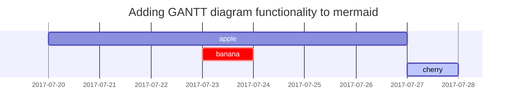

## Understand Basics

[Text and Typography](https://chirpy.cotes.page/posts/text-and-typography/)

<https://github.com/cotes2020/jekyll-theme-chirpy/blob/master/_posts/2019-08-08-text-and-typography.md?plain=1>

## Paragraph

Jekyll is a static site generator that transforms plain text into static websites and blogs. When used together with Markdown, Jekyll allows users to write content in a simple, readable format that can be easily converted into HTML. Markdown's straightforward syntax makes it easy to format text, create lists, add links, and include code snippets, while Jekyll handles the layout and structure of the site. This combination provides a powerful yet user-friendly way to create and manage static websites.

## Lists

### Ordered list

1. Firstly
2. Secondly
3. Thirdly

### Unordered list

- Chapter
  - Section
    - Paragraph

### ToDo list

- [ ] Job
  - [x] Step 1
  - [x] Step 2
  - [ ] Step 3

### Description list

Sun
: the star around which the earth orbits

Moon
: the natural satellite of the earth, visible by reflected light from the sun

## Block Quote

> This line shows the _block quote_.

## Prompts

> An example showing the `tip` type prompt.
{: .prompt-tip }

> An example showing the `info` type prompt.
{: .prompt-info }

> An example showing the `warning` type prompt.
{: .prompt-warning }

> An example showing the `danger` type prompt.
{: .prompt-danger }


## Tables

| Left Aligned | Center Aligned | Right Aligned |
|:------------ |:--------------:| -------------:|
| Row 1 Col 1  | Row 1 Col 2    | Row 1 Col 3   |
| Row 2 Col 1  | Row 2 Col 2    | Row 2 Col 3   |

## Links & Images

> Link to [Chirpy](https://chirpy.cotes.page)

---

<http://127.0.0.1:4000>

***


_Ant holding Watermelon_

## Inline code

This is an example of `Inline Code`.

## Code blocks

### Common

```text
This is a common code snippet, without syntax highlight and line number.
```

### Specific Language

```bash
if [ $? -ne 0 ]; then
  echo "The command was not successful.";
  #do the needful / exit
fi;
```

## Mathematics

The mathematics powered by [**MathJax**](https://www.mathjax.org/):

$$ x = \frac{-b \pm \sqrt{b^2-4ac}}{2a} $$

This is an inline equation: $E = mc^2$.

This is a displayed equation:
$$
a^2 + b^2 = c^2
$$

## Mermaid SVG



## Video



| Video URL                                                                                          | Platform   | ID             |
| -------------------------------------------------------------------------------------------------- | ---------- | :------------- |
| [https://www.**youtube**.com/watch?v=**H-B46URT4mg**](https://www.youtube.com/watch?v=H-B46URT4mg) | `youtube`  | `H-B46URT4mg`  |
| [https://www.**twitch**.tv/videos/**1634779211**](https://www.twitch.tv/videos/1634779211)         | `twitch`   | `1634779211`   |
| [https://www.**bilibili**.com/video/**BV1Q44y1B7Wf**](https://www.bilibili.com/video/BV1Q44y1B7Wf) | `bilibili` | `BV1Q44y1B7Wf` |

## Footnote

Click the hook will locate the footnote[^footnote], and here is another footnote[^fn-nth-2].

## Reverse Footnote

[^footnote]: The footnote source
[^fn-nth-2]: The 2nd footnote source
