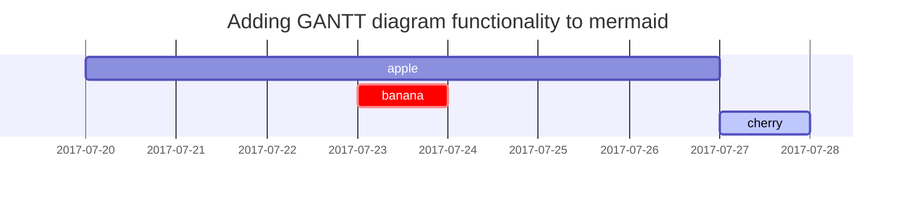

Link to [Writing a New Post](https://chirpy.cotes.page/posts/write-a-new-post/). Footnote1 here [^fn1]   
> <https://github.com/cotes2020/jekyll-theme-chirpy/blob/master/_posts/2019-08-08-write-a-new-post.md?plain=1>

Link to [Text and Typography](https://chirpy.cotes.page/posts/text-and-typography/). Footnote2 here [^fn2]   
> <https://github.com/cotes2020/jekyll-theme-chirpy/blob/master/_posts/2019-08-08-text-and-typography.md?plain=1>

<br>  
Link to [Use Jekyll](https://khoapham1002.github.io/mindpalace/posts/use-jekyll/)

Jekyll is a static site generator that transforms plain text into static websites and blogs. When used together with Markdown, Jekyll allows users to write content in a simple, readable format that can be easily converted into HTML. Markdown's straightforward syntax makes it easy to format text, create lists, add links, and include code snippets, while Jekyll handles the layout and structure of the site. This combination provides a powerful yet user-friendly way to create and manage static websites.


## Links   
> Link to [Chirpy](https://chirpy.cotes.page)

```markdown
Link to [Chirpy](https://chirpy.cotes.page)
```


## Headings   
```markdown
# Header 1
## Header 2
### Header 3
#### Header 4
##### Header 5
###### Header 6
```


## Emphasis   
*italic* or _italic_ <br>
**bold** or __bold__ <br>
***bold and italic*** or ___bold and italic___ <br>
This is <strong>bold</strong> text using HTML syntax. <br>

~~This is strikethrough text.~~

```markdown
*italic* or _italic_ <br>
**bold** or __bold__ <br>
***bold and italic*** or ___bold and italic___ <br>
This is <strong>bold</strong> text using HTML syntax. <br>

~~This is strikethrough text.~~
```


## Ordered list   
1. Firstly
2. Secondly
3. Thirdly

```markdown
1. Firstly
2. Secondly
3. Thirdly
```


## Unordered list   
- Chapter
  - Section 1
    - Paragraph 1
  - Section 2
    - Paragraph 2

```markdown
- Chapter
  - Section 1
    - Paragraph 1
  - Section 2
    - Paragraph 2
```

## ToDo list   
- [ ] Job
  - [x] Step 1
  - [ ] Step 2
    - [x] Step 2.1
    - [ ] Step 2.2
  - [ ] Step 3

```markdown
- [ ] Job
  - [x] Step 1
  - [ ] Step 2
    - [x] Step 2.1
    - [ ] Step 2.2
  - [ ] Step 3
```


## Description list   
***Term 1***
: _Definition of term 1_   
**Term 2**
: ~~Wrong definition of term 2~~

```markdown
***Term 1***
: _Definition of term 1_   
**Term 2**
: ~~Wrong definition of term 2~~
```


## Tables   

| Header 1 | Header 2 |
| -------- | -------- |
| Row 1 Col 1 | Row 1 Col 2 |
| Row 2 Col 1 | Row 2 Col 2 |

```markdown
| Header 1 | Header 2 |
| -------- | -------- |
| Row 1 Col 1 | Row 1 Col 2 |
| Row 2 Col 1 | Row 2 Col 2 |
```

| Left Aligned | Center Aligned | Right Aligned |
|:------------ |:--------------:| -------------:|
| Row 1 Col 1  | Row 1 Col 2    | Row 1 Col 3   |
| Row 2 Col 1  | Row 2 Col 2    | Row 2 Col 3   |

```markdown
| Left Aligned | Center Aligned | Right Aligned |
|:------------ |:--------------:| -------------:|
| Row 1 Col 1  | Row 1 Col 2    | Row 1 Col 3   |
| Row 2 Col 1  | Row 2 Col 2    | Row 2 Col 3   |
```

## Block Quote   
> This line shows the _block quote_.  

>> This line shows the _nested block quote_.  
>>> This line shows the _nested block quote_.

>> This line shows the _nested block quote_.  
>>>> This line shows the _nested block quote_.  
>>> This line shows the _nested block quote_.   

```markdown
> This line shows the _block quote_.  

>> This line shows the _nested block quote_.  
>>> This line shows the _nested block quote_.

>> This line shows the _nested block quote_.  
>>>> This line shows the _nested block quote_.  
>>> This line shows the _nested block quote_.  
```


## Prompts   
> An example showing the `tip` type prompt.
{: .prompt-tip }

> An example showing the `info` type prompt.
{: .prompt-info }

> An example showing the `warning` type prompt.
{: .prompt-warning }

> An example showing the `danger` type prompt.
{: .prompt-danger }

```markdown
> An example showing the `tip` type prompt.
{: .prompt-tip }

> An example showing the `info` type prompt.
{: .prompt-info }

> An example showing the `warning` type prompt.
{: .prompt-warning }

> An example showing the `danger` type prompt.
{: .prompt-danger }
```


## Inline Code   
This is an example of `Inline Code`.

```markdown
This is an example of `Inline Code`.
```


### Filepath   
Here is the `/path/to/the/file.extend`{: .filepath}.

```markdown
Here is the `/path/to/the/file.extend`{: .filepath}.
```


## Code blocks   
```text
This is a common code snippet, 
without syntax highlight and line number.
```

````md
```text
This is a common code snippet, 
without syntax highlight and line number.
```
````

### Line Number   
By default, all languages except `plaintext`, `console`, and `terminal` will display line numbers. Add the class `nolineno` to hide the line numbers:

```text
This is a common code snippet, 
without syntax highlight and line number.
```
{: .nolineno }


````md
```text
This is a common code snippet, 
without syntax highlight and line number.
```
{: .nolineno }
````


### Specific Language
Using ```` ```{language} ```` you will get a code block with syntax highlight:

```python
x = 10
if x > 5:
    print("x is greater than 5")
else:
    print("x is not greater than 5") 
```

````markdown
```python
x = 10
if x > 5:
    print("x is greater than 5")
else:
    print("x is not greater than 5") 
```
````


### Specific filename
```sass
@import
  "colors/light-typography",
  "colors/dark-typography";
```
{: file='_sass/jekyll-theme-chirpy.scss'}


````markdown
```sass
@import
  "colors/light-typography",
  "colors/dark-typography";
```
{: file='_sass/jekyll-theme-chirpy.scss'}
````


### Liquid Codes   
````markdown
```liquid

  This product's title contains the word Pack.

```
````


## Math & LaTeX   
The mathematics powered by [**MathJax**](https://www.mathjax.org/):

This is a displayed equation:  
$$
a^2 + b^2 = c^2
$$

```markdown
This is a displayed equation:   
$$
a^2 + b^2 = c^2
$$
```

When $$a \ne 0$$, there are two solutions to $$ax^2 + bx + c = 0$$ and they are: 
$$ x = {-b \pm \sqrt{b^2-4ac} \over 2a} $$

```markdown
When $$a \ne 0$$, there are two solutions to $$ax^2 + bx + c = 0$$ and they are: 
$$ x = {-b \pm \sqrt{b^2-4ac} \over 2a} $$
```

This is a geometric series:   
$$
\begin{equation}
  S = \sum_{n=0}^{\infty} ar^n = \frac{a}{1 - r}
  \label{eq:series}
\end{equation}
$$   
We can reference the equation as \eqref{eq:series}.   

```markdown
This is a geometric series:   
$$
\begin{equation}
  S = \sum_{n=0}^{\infty} ar^n = \frac{a}{1 - r}
  \label{eq:series}
\end{equation}
$$   
We can reference the equation as \eqref{eq:series}.
```


1. For markdown, LaTex inline equation: $$E = m \times c^2$$
2. For HTML rendering inline equation: \\( E = mc^2 \\)
3. \$$E = mc^2$$

```markdown
1. For markdown, LaTex inline equation: $$E = m \times c^2$$
2. For HTML rendering inline equation: \\( E = mc^2 \\)
3. \$$E = mc^2$$
```


## Mermaid SVG   


````markdown
```mermaid
 gantt
  title Adding GANTT diagram functionality to mermaid
  apple :a, 2017-07-20, 1w
  banana :crit, b, 2017-07-23, 1d
  cherry :active, c, after b a, 1d
```
````

## Images   
{: .shadow }
_Potter's Doe Patronous_

{: w="200" h="200" }{: .normal }


```markdown
{: .shadow }
_Potter's Doe Patronous_   

{: w="200" h="200" }{: .normal }

<!-- {: width="700" height="400" }
{: .left }
{: .right } -->
```

## Video

### Video File   


````markdown



You can also specify additional attributes for the embedded video file. Here is a full list of attributes allowed:   
 
````

- `types` — specify the extensions of additional video formats separated by `|`. Ensure these files exist in the same directory
- `poster='/path/to/poster.png'` — poster image for a video that is shown while video is downloading
- `title='Text'` — title for a video that appears below the video and looks same as for images
- `autoplay=true` — video automatically begins to play back as soon as it can
- `loop=true` — automatically seek back to the start upon reaching the end of the video
- `muted=true` — audio will be initially silenced


### Social Media Platform    


| Video URL      | Platform   | ID             |
| -------------- | ---------- | :------------- |
| [https://www.**youtube**.com/watch?v=**PsP2vsy_8ms**](https://www.youtube.com/watch?v=PsP2vsy_8ms)    | `youtube`        | `PsP2vsy_8ms`  |
| [https://www.**twitch**.tv/videos/**1634779211**](https://www.twitch.tv/videos/1634779211)            | `twitch`         | `1634779211`   |

````markdown



| Video URL      | Platform   | ID             |
| -------------- | ---------- | :------------- |
| [https://www.**youtube**.com/watch?v=**PsP2vsy_8ms**](https://www.youtube.com/watch?v=PsP2vsy_8ms)    | `youtube`        | `PsP2vsy_8ms`  |
| [https://www.**twitch**.tv/videos/**1634779211**](https://www.twitch.tv/videos/1634779211)            | `twitch`         | `1634779211`   |

````

## Footnotes

```markdown
Click the hook will locate the footnote[^footnote], 
and here is another footnote[^fn-2nd].

{content}

[^footnote]: The footnote source
[^fn-2nd]: The 2nd footnote source
```

### Post's Footnotes

---

[^fn1]: Check footnote1 `Writing a New Post` post
[^fn2]: Check footnote2 `Text and Typography` post
